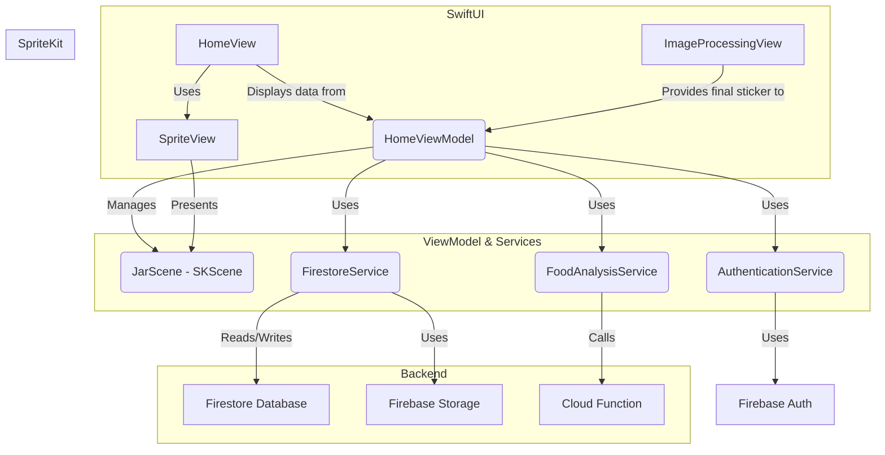
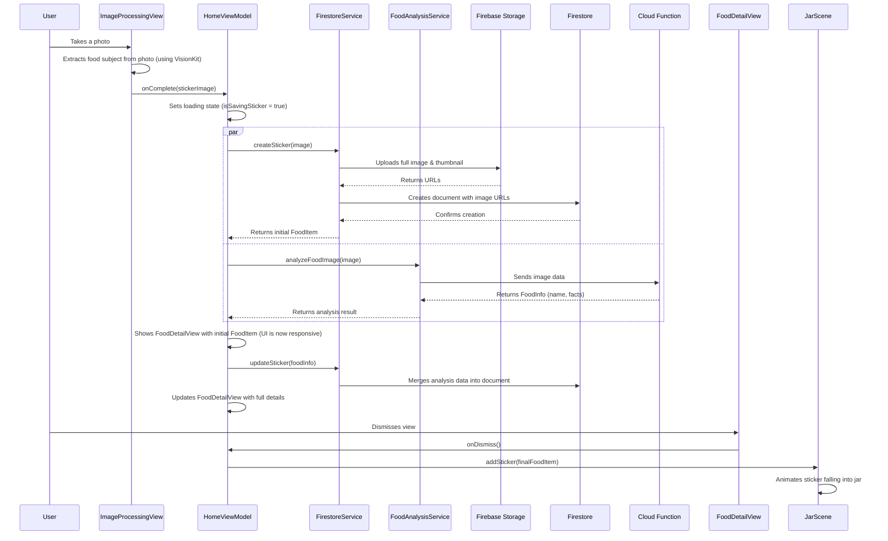

# FoodStickerJarApp Onboarding
## 1. Overview

FoodStickerJarApp is a SwiftUI application that allows users to take pictures of food, automatically turn them into "stickers" with a white outline, and drop them into a virtual "jar." The stickers in the jar interact with each other using a 2D physics engine (SpriteKit) and respond to the device's motion. Tapping on a sticker reveals details about the food item, including its name, a fun fact, and nutritional information, which are fetched from a backend service.

## 2. Architecture

The app is built using a modern SwiftUI approach, primarily following the **Model-View-ViewModel (MVVM)** design pattern. For features that are not natively available in SwiftUI, the app uses `UIViewRepresentable` and `UIViewControllerRepresentable` to bridge UIKit and SpriteKit components.

### Core Components:

*   **Views (SwiftUI):** The UI is built entirely in SwiftUI. Key views include `HomeView` (the main screen), `FoodDetailView` (shows sticker info), and `ImageProcessingView` (handles the camera and sticker creation flow).
*   **ViewModels (`HomeViewModel`):** This is the central hub of the application's logic. It manages the state, communicates with services, and provides data to the views via Combine publishers (`@Published` properties).
*   **Models (`FoodItem`, `FoodInfo`):** Simple `Codable` structs that represent the application's data.
*   **Services:** A suite of services handles distinct responsibilities like authentication, database interaction, and physics simulation. This keeps the `HomeViewModel` clean and focused.
*   **SwiftUI -> SpriteKit Bridge:** The `SpriteView` (`UIViewControllerRepresentable`) hosts the `JarScene` (`SKScene`) within the SwiftUI view hierarchy, allowing the physics simulation to be a seamless part of the UI.

### Architecture Diagram



## 3. Project Structure

The project is organized into logical groups to make navigation and maintenance straightforward.

```
FoodStickerJarApp/
├── App/
│   ├── AppDelegate.swift       # Configures Firebase on launch.
│   └── FoodStickerJarApp.swift # The main SwiftUI App entry point.
├── Models/
│   ├── FoodItem.swift          # Data model for a sticker, stored in Firestore.
│   └── FoodInfo.swift          # Data model for the analysis result from the backend.
├── Services/
│   ├── Analysis/
│   │   └── FoodAnalysisService.swift # Communicates with the backend Cloud Function.
│   ├── Authentication/
│   │   └── AuthenticationService.swift # Manages user authentication with Firebase Auth.
│   ├── Persistence/
│   │   ├── FirestoreService.swift    # Handles all read/write operations with Firestore.
│   │   └── FirebaseStorageService.swift # Handles image uploads to Firebase Storage.
│   └── Physics/
│       ├── JarScene.swift          # The core SpriteKit scene with all the physics logic.
│       └── GameViewController.swift # 🚨 UNUSED FILE - Can be deleted.
├── ViewModels/
│   └── HomeViewModel.swift       # The central brain of the app.
└── Views/
    ├── Common/                   # Shared UI components.
    ├── Components/
    │   └── SpriteView.swift      # The bridge from SwiftUI to SpriteKit.
    ├── Home/
    │   ├── HomeView.swift        # The main screen containing the jar.
    │   └── FoodDetailView.swift  # The view that shows sticker details.
    └── ImageProcessing/
        ├── CameraView.swift      # Wraps UIImagePickerController.
        ├── ImageProcessingView.swift # Manages the image capture/cropping flow.
        └── SubjectLiftView.swift # Wraps VisionKit for automatic subject extraction.
```

## 4. Core Features & Data Flow

### Sticker Creation Flow

This is the primary feature of the app. The process is optimized for a fast user experience by running tasks in parallel.



### The Physics Jar

-   **SpriteKit & `JarScene`:** The jar is a `SKScene`. It uses a physics world with gravity that is influenced by the device's accelerometer (`CMMotionManager`), allowing the user to "shake" the stickers around.
-   **Boundaries:** An invisible, non-rectangular boundary (`SKPhysicsBody(edgeLoopFrom: path)`) matching the shape of the jar image keeps the stickers contained.
-   **Stickers:** Each sticker is an `SKSpriteNode`. Its physics body is generated from the sticker's texture for accurate collision detection.
-   **Interaction:** The scene detects taps on stickers and uses a Combine `PassthroughSubject` (`onStickerTapped`) to notify the `HomeViewModel` which sticker was selected.

## 5. Dependencies

The app relies on a few key third-party libraries managed via Swift Package Manager:

-   **Firebase:**
    -   `FirebaseAuth`: For user authentication.
    -   `FirebaseFirestore`: For the main database.
    -   `FirebaseFirestoreSwift`: For `Codable` support with Firestore.
    -   `FirebaseStorage`: For storing all sticker images.
-   **Kingfisher:** A powerful library for downloading and caching images from the web. It's used in `JarScene` to load sticker thumbnails and in `FoodDetailView` for the full-resolution image.

## 6. Getting Started

To build and run the project, you will need:

1.  **Xcode:** The latest version is recommended.
2.  **Firebase Project:**
    -   Create a new project on the [Firebase Console](https://console.firebase.google.com/).
    -   Add an iOS app to the project.
    -   Download the `GoogleService-Info.plist` file provided during the setup.
    -   **Place `GoogleService-Info.plist` in the `FoodStickerJarApp/FoodStickerJarApp/` directory.** (It's included in the `.gitignore`, so you'll need to add it yourself).
    -   Enable the following Firebase services:
        -   **Authentication:** Enable the "Email/Password" sign-in method.
        -   **Firestore:** Create a new database. You will need to set up the security rules to allow authenticated users to read/write their own data.
        -   **Storage:** Create a new storage bucket.
3.  **Backend Cloud Function:**
    -   The `FoodAnalysisService` points to a deployed Google Cloud Function. You will need to deploy your own version of this function (the source code is in the `backend` directory) or get the URL from a team member.
    -   Update the `cloudFunctionURLString` in `FoodAnalysisService.swift` with your function's trigger URL.
4.  **Build & Run:** Open the `.xcodeproj` file and run the app on a simulator or physical device.